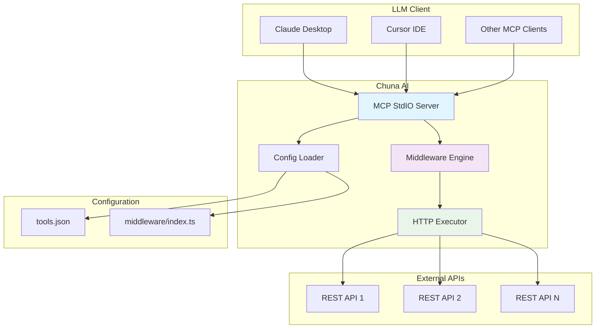

# Chuna AI

**Expose any REST API as an MCP server without writing a single line of code.**

Chuna AI is a gateway for LLMs to access APIs for any organization. It can expose all APIs as MCP (Model Context Protocol) servers so LLMs can understand and interact with them without writing a single line of code.

## 🚀 Features

- **Zero Code Configuration**: Define APIs using simple JSON configuration
- **MCP Protocol Support**: Works with Claude Desktop, Cursor, and other MCP clients
- **Middleware System**: Add authentication, logging, validation, and custom logic
- **Environment Variables**: Secure token management with `${ENV:VAR}` substitution
- **Multiple HTTP Methods**: Support for GET, POST, PUT, PATCH, DELETE
- **TypeScript**: Built with TypeScript for reliability and type safety

## 🏗️ Architecture



## 📋 How It Works

1. **Configuration**: Define your APIs in `tools.json` with optional middleware
2. **Start Server**: Run `chuna-ai serve -c ./config` 
3. **MCP Integration**: Configure in your LLM client (Claude Desktop, Cursor, etc.)
4. **LLM Interaction**: Ask the LLM to use your APIs as tools

## 🛠️ Installation

```bash
# Clone the repository
git clone https://github.com/Krishank/chuna-ai.git
cd chuna-ai

# Install dependencies
npm install

# Build the project
npm run build
```

## ⚙️ Configuration

### Basic Setup

Create a `config/tools.json` file:

```json
[
  {
    "name": "products_list",
    "description": "List all products from the API",
    "method": "GET",
    "url": "https://api.example.com/products"
  },
  {
    "name": "create_product",
    "description": "Create a new product",
    "method": "POST", 
    "url": "https://api.example.com/products",
    "headers": {
      "Content-Type": "application/json"
    }
  }
]
```

### With Middleware

```json
[
  {
    "name": "secure_products",
    "description": "List products with authentication and logging",
    "method": "GET",
    "url": "https://api.example.com/products",
    "preMiddleware": ["addAuthHeader", "logRequest"],
    "postMiddleware": ["validateResponse", "logResponse"]
  }
]
```

### Environment Variables

Use environment variables for sensitive data:

```json
[
  {
    "name": "authenticated_call",
    "method": "GET",
    "url": "https://api.example.com/data",
    "headers": {
      "Authorization": "Bearer ${ENV:API_TOKEN}"
    }
  }
]
```

## 🔧 Middleware System

### Available Middleware

- `addAuthHeader` - Adds Authorization header
- `logRequest` - Logs HTTP requests
- `logResponse` - Logs HTTP responses
- `addTimestamp` - Adds X-Timestamp header
- `validateResponse` - Throws error for 4xx/5xx responses

### Custom Middleware

Add custom middleware in `src/middleware/index.ts`:

```typescript
export const customAuth: PreMiddleware = (spec, context) => {
  return {
    ...spec,
    headers: {
      ...spec.headers,
      'X-API-Key': process.env.CUSTOM_API_KEY,
    },
  };
};

export const transformResponse: PostMiddleware = async (result, context) => {
  return {
    ...result,
    body: {
      data: result.body,
      timestamp: new Date().toISOString(),
    },
  };
};
```

Then use in your config:

```json
{
  "name": "my_tool",
  "method": "GET", 
  "url": "https://api.example.com/data",
  "preMiddleware": ["customAuth"],
  "postMiddleware": ["transformResponse"]
}
```

## 🚀 Usage

### CLI Mode

```bash
# Start the MCP server
node dist/cli.cjs serve -c ./config

# Or with npm
npm run build
npx chuna-ai serve -c ./config
```

### Library Mode

```typescript
import { startMcpServer, loadConfigFromPath } from 'chuna-ai';

const config = await loadConfigFromPath('./config');
await startMcpServer({ config });
```

## 🔌 MCP Client Integration

Chuna AI works with any MCP-compatible client. Here are the most popular options:

### 🤖 Claude Desktop (Anthropic)

**Best for**: General AI assistance with API integration

**Setup**:
1. Download Claude Desktop from [Anthropic's website](https://claude.ai/download)
2. Find your config file:
   - **macOS**: `~/Library/Application Support/Claude/claude_desktop_config.json`
   - **Windows**: `%APPDATA%\Claude\claude_desktop_config.json`
3. Add Chuna AI server:

```json
{
  "mcpServers": {
    "chuna-ai": {
      "command": "node",
      "args": [
        "/path/to/chuna-ai/dist/cli.cjs",
        "serve",
        "-c", 
        "/path/to/chuna-ai/config"
      ]
    }
  }
}
```

4. Restart Claude Desktop
5. In a new conversation, ask: "What tools are available?" or "List my API tools"

### 💻 Cursor IDE

**Best for**: Code development with API integration

**Setup**:
1. Open Cursor IDE
2. Go to Settings → Features → Model Context Protocol
3. Click "Edit JSON" and add:

```json
{
  "mcpServers": {
    "chuna-ai": {
      "command": "node",
      "args": [
        "/path/to/chuna-ai/dist/cli.cjs",
        "serve",
        "-c",
        "/path/to/chuna-ai/config"
      ]
    }
  }
}
```

4. Click "Reload" in MCP settings
5. Open a new chat and use your API tools

### 🧠 Continue.dev

**Best for**: VS Code with AI coding assistance

**Setup**:
1. Install Continue extension in VS Code
2. Open Continue settings (`Cmd/Ctrl + Shift + P` → "Continue: Open config")
3. Add to `config.json`:

```json
{
  "mcpServers": {
    "chuna-ai": {
      "command": "node",
      "args": [
        "/path/to/chuna-ai/dist/cli.cjs",
        "serve",
        "-c",
        "/path/to/chuna-ai/config"
      ]
    }
  }
}
```

4. Restart VS Code
5. Use `@` in Continue chat to access your tools

### 🔧 MCP Inspector (Development)

**Best for**: Testing and debugging MCP servers

**Setup**:
```bash
# Install MCP Inspector
npm install -g @modelcontextprotocol/inspector

# Start your Chuna AI server
node dist/cli.cjs serve -c ./config

# In another terminal, start inspector
mcp-inspector
```

**Features**:
- Visual tool testing interface
- Request/response inspection
- Middleware debugging
- Real-time tool execution

### 🐍 Python MCP Client

**Best for**: Custom Python applications

```python
import asyncio
from mcp import ClientSession, StdioServerParameters
from mcp.client.stdio import stdio_client

async def main():
    server_params = StdioServerParameters(
        command="node",
        args=["/path/to/chuna-ai/dist/cli.cjs", "serve", "-c", "/path/to/chuna-ai/config"]
    )
    
    async with stdio_client(server_params) as (read, write):
        async with ClientSession(read, write) as session:
            # List available tools
            tools = await session.list_tools()
            print(f"Available tools: {[tool.name for tool in tools.tools]}")
            
            # Call a tool
            result = await session.call_tool("products_list", {})
            print(f"Result: {result.content}")

asyncio.run(main())
```

### 🌐 Web-based MCP Clients

**Best for**: Browser-based AI applications

Popular options:
- **MCP Web Client**: Browser-based MCP client
- **Custom Web Apps**: Build your own using MCP WebSocket transport

### 📱 Mobile MCP Clients

**Best for**: Mobile AI applications

- **Claude Mobile**: iOS/Android apps with MCP support
- **Custom Mobile Apps**: Integrate MCP in React Native/Flutter apps

## 🎯 Client Comparison

| Client | Best For | Ease of Setup | Features |
|--------|----------|---------------|----------|
| **Claude Desktop** | General AI assistance | ⭐⭐⭐⭐⭐ | Full conversation, tool calling |
| **Cursor IDE** | Code development | ⭐⭐⭐⭐ | Code context, API integration |
| **Continue.dev** | VS Code development | ⭐⭐⭐⭐ | Inline code assistance |
| **MCP Inspector** | Testing/Debugging | ⭐⭐⭐ | Visual interface, debugging |
| **Python Client** | Custom applications | ⭐⭐ | Full programmatic control |
| **Web Clients** | Browser apps | ⭐⭐ | Web-based AI applications |

## 🚀 Quick Start Examples

### Example 1: E-commerce with Claude Desktop

```json
// config/tools.json
[
  {
    "name": "get_products",
    "description": "Get all products from our store",
    "method": "GET",
    "url": "https://api.mystore.com/products",
    "preMiddleware": ["addAuthHeader", "logRequest"]
  }
]
```

**Claude Conversation**:
```
You: "Show me all products in our store"
Claude: I'll get the products for you using the get_products tool.
[Claude calls get_products tool]
Claude: Here are all the products in your store: [product list]
```

### Example 2: CRM Integration with Cursor

```json
// config/tools.json
[
  {
    "name": "create_lead",
    "description": "Create a new sales lead",
    "method": "POST",
    "url": "https://crm.company.com/leads",
    "headers": {
      "Authorization": "Bearer ${ENV:CRM_TOKEN}",
      "Content-Type": "application/json"
    },
    "preMiddleware": ["logRequest"],
    "postMiddleware": ["validateResponse"]
  }
]
```

**Cursor Chat**:
```
You: "Create a lead for John Doe, email john@example.com, interested in our premium plan"
Cursor: I'll create that lead for you using the CRM API.
[Cursor calls create_lead tool with the provided information]
```

## 🔍 Troubleshooting

### Common Issues

1. **Tool not appearing**: Check MCP server is running and config is valid
2. **Authentication errors**: Verify environment variables are set
3. **Connection issues**: Ensure paths in MCP config are absolute
4. **Middleware errors**: Check middleware function names match exports

### Debug Mode

```bash
# Run with debug logging
DEBUG=* node dist/cli.cjs serve -c ./config
```

### Health Check

```bash
# Test MCP server manually
echo '{"jsonrpc":"2.0","id":1,"method":"tools/list","params":{}}' | node dist/cli.cjs serve -c ./config
```

## 💡 Example Workflows

### E-commerce API

```json
[
  {
    "name": "list_products",
    "description": "Get all products",
    "method": "GET",
    "url": "https://api.shop.com/products"
  },
  {
    "name": "create_order", 
    "description": "Create a new order",
    "method": "POST",
    "url": "https://api.shop.com/orders",
    "preMiddleware": ["addAuthHeader", "logRequest"]
  },
  {
    "name": "update_inventory",
    "description": "Update product inventory",
    "method": "PUT", 
    "url": "https://api.shop.com/inventory",
    "preMiddleware": ["addAuthHeader"]
  }
]
```

### CRM Integration

```json
[
  {
    "name": "get_contacts",
    "description": "Retrieve all contacts",
    "method": "GET", 
    "url": "https://crm.example.com/contacts",
    "headers": {
      "Authorization": "Bearer ${ENV:CRM_TOKEN}"
    },
    "preMiddleware": ["logRequest"],
    "postMiddleware": ["validateResponse"]
  },
  {
    "name": "create_lead",
    "description": "Create a new sales lead", 
    "method": "POST",
    "url": "https://crm.example.com/leads",
    "headers": {
      "Authorization": "Bearer ${ENV:CRM_TOKEN}",
      "Content-Type": "application/json"
    }
  }
]
```

## 🧪 Testing

```bash
# Run tests
npm test

# Run tests in watch mode
npm run test:watch

# Type checking
npm run typecheck

# Linting
npm run lint
```

## 📦 Development

```bash
# Watch mode for development
npm run dev

# Build for production
npm run build

# Format code
npm run format
```

## 🤝 Contributing

1. Fork the repository
2. Create a feature branch: `git checkout -b feature/amazing-feature`
3. Commit changes: `git commit -m 'Add amazing feature'`
4. Push to branch: `git push origin feature/amazing-feature`
5. Open a Pull Request

## 📄 License

This project is licensed under the MIT License - see the [LICENSE](LICENSE) file for details.

## 🙏 Acknowledgments

- Built for the MCP (Model Context Protocol) ecosystem
- Inspired by the need for seamless LLM-API integration
- Thanks to the open-source community for the tools and libraries

---

**Made with ❤️ for the AI community**